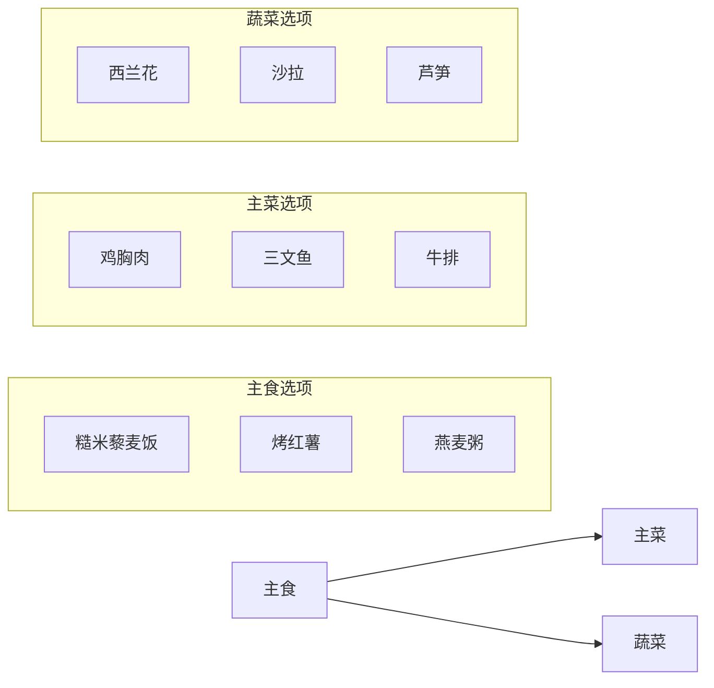

# 高蛋白健身餐食谱

> **适用场景**：增肌期、减脂期、日常健康饮食  
> **核心原则**：高蛋白、优质碳水、健康脂肪  
> **蛋白质来源**：鸡胸肉、三文鱼、虾、鸡蛋、豆腐、希腊酸奶等

---

## 目录

### 📋 个人化方案

| 内容 | 链接 |
|------|------|
| 基于您实际饮食的优化方案 | [个人化健身餐方案](custom-meal-plan/) |

### 🥩 主菜（高蛋白）

| 序号 | 食谱 | 蛋白质含量 | 热量 |
|------|------|-----------|------|
| 1 | [香煎牛排](pan-seared-steak/) | ~42g | ~450kcal |
| 2 | [香煎鸡胸肉配西兰花](chicken-breast-with-broccoli/) | ~46g | ~350kcal |
| 3 | [三文鱼牛油果沙拉](salmon-avocado-salad/) | ~35g | ~420kcal |
| 4 | [虾仁蔬菜炒蛋白](shrimp-vegetable-egg-white/) | ~49g | ~280kcal |
| 5 | [希腊酸奶莓果碗](greek-yogurt-berry-bowl/) | ~28g | ~320kcal |
| 6 | [豆腐藜麦蔬菜碗](tofu-quinoa-bowl/) | ~25g | ~300kcal |
| 7 | [火鸡肉蔬菜卷](turkey-vegetable-wrap/) | ~37g | ~380kcal |
| 8 | [金枪鱼蔬菜沙拉](tuna-vegetable-salad/) | ~47g | ~400kcal |
| 9 | [鸡蛋蔬菜欧姆蛋](egg-vegetable-omelet/) | ~32g | ~320kcal |

### 🍚 主食（碳水化合物）

| 序号 | 食谱 | 碳水含量 | 热量 | 标记 |
|------|------|---------|------|------|
| 1 | [糙米藜麦饭](carbs-brown-rice-quinoa/) | ~45g/100g | ~130kcal/100g | ✅ 减脂期适用 |
| 2 | [烤红薯](carbs-baked-sweet-potato/) | ~20g/100g | ~90kcal/100g | ✅ 减脂期适用 |
| 3 | [燕麦粥](carbs-oatmeal/) | ~25g/100g | ~110kcal/100g | ✅ 减脂期适用 |

### 🥗 配菜

| 序号 | 食谱 | 热量 | 适合搭配 |
|------|------|------|---------|
| 1 | [烤芦笋/烤土豆蘑菇/蘑菇红酒汁](side-dishes/) | ~30-80kcal/100g | 牛排/鸡胸肉/吊龙 |

### 🩹 抗炎食谱

| 序号 | 食谱 | 特点 | 适合场景 |
|------|------|------|---------|
| 1 | [彩椒紫甘蓝沙拉/三文鱼牛油果碗/姜黄咖喱](anti-inflammatory-meals/) | 富含抗氧化剂、Omega-3 | 日常健康饮食 |

---

## 健身餐搭配建议

### 经典搭配示例

| 餐次 | 主食 | 主菜 | 蔬菜 |
|------|------|------|------|
| 早餐 | 燕麦粥 | 鸡蛋欧姆蛋 | 菠菜 |
| 午餐 | 糙米藜麦饭 | 鸡胸肉 | 西兰花 |
| 晚餐 | 烤红薯 | 三文鱼 | 混合沙拉 |

### 不用加热的午餐方案

| 方案 | 食谱链接 | 适合场景 |
|------|---------|---------|
| 便携三明治 | [鸡胸肉三明治（待创建）] | 上班带饭 |
| 沙拉碗 | [三文鱼牛油果沙拉](salmon-avocado-salad/) | 上班带饭 |
| 沙拉碗 | [金枪鱼蔬菜沙拉](tuna-vegetable-salad/) | 上班带饭 |
| 酸奶碗 | [希腊酸奶莓果碗](greek-yogurt-berry-bowl/) | 早餐/加餐 |

---

## 健身餐饮食建议

### 蛋白质摄入量参考

| 目标 | 每日蛋白质摄入量 |
|------|----------------|
| 维持体重 | 1.0-1.2g/kg体重 |
| 增肌 | 1.6-2.2g/kg体重 |
| 减脂 | 1.6-2.0g/kg体重 |

### 碳水化合物选择原则

| 类型 | 推荐食材 | 特点 |
|------|---------|------|
| **低GI** | 糙米、藜麦、燕麦、红薯 | 消化慢，血糖稳定 |
| **高纤维** | 全麦面包、燕麦、豆类 | 饱腹感强 |
| **快速吸收** | 白米饭、面条 | 适合运动后补充 |

### 食材选择原则

1. **蛋白质**：优先选择鸡胸肉、鱼肉、虾、鸡蛋、低脂乳制品、豆制品
2. **碳水**：糙米、藜麦、燕麦、红薯、全麦面包
3. **脂肪**：牛油果、坚果、橄榄油、深海鱼油
4. **蔬菜**：西兰花、菠菜、芦笋、黄瓜、番茄

### 烹饪方式建议

- ✅ 推荐：蒸、煮、烤、快炒
- ❌ 避免：油炸、红烧、长时间炖煮

---

## 修订记录

| 日期 | 变更 |
|------|------|
| 2026-05-28 | 添加个人化健身餐方案 |
| 2026-05-28 | 添加3种碳水化合物主食食谱 |
| 2026-05-28 | 初版：8道高蛋白健身餐食谱 |

---

> **注意**：以上食谱为通用建议，具体用量可根据个人身体状况和目标调整。如有特殊健康问题，请咨询专业营养师。
