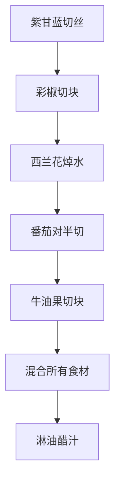
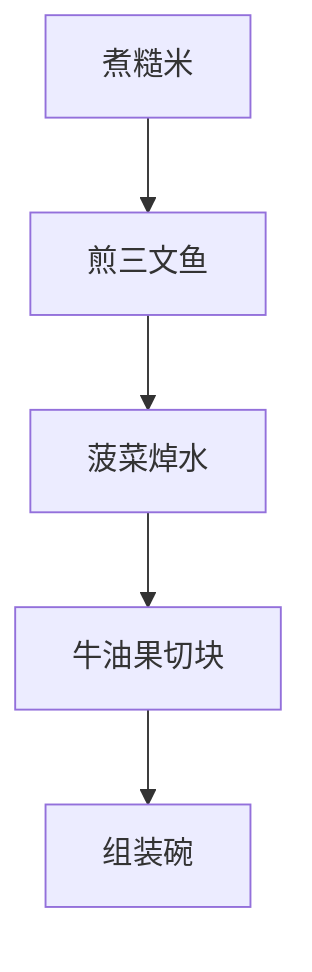
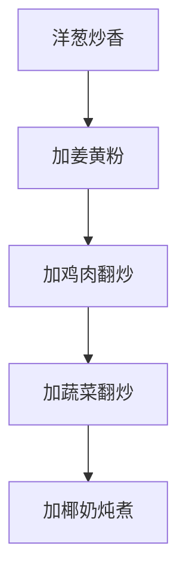
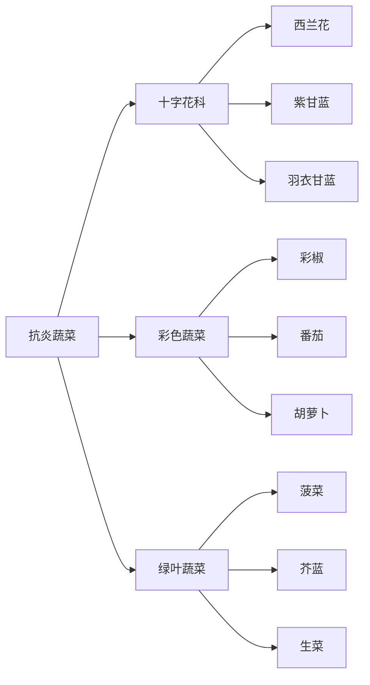

# 抗炎食谱

> **核心原则**：富含抗氧化剂、Omega-3、膳食纤维  
> **适用场景**：日常健康饮食、抗炎需求  
> **关键食材**：彩椒、紫甘蓝、蓝莓、三文鱼等

---

## 一、抗炎食物概述

### 1.1 抗炎蔬菜

| 蔬菜 | 抗炎成分 | 特点 |
|------|---------|------|
| **彩椒** | 维生素C、类黄酮 | 鲜艳颜色，口感爽脆 |
| **紫甘蓝** | 花青素、维生素K | 紫色抗氧化，适合凉拌 |
| **西兰花** | 萝卜硫素 | 十字花科蔬菜之王 |
| **菠菜** | 维生素E、叶黄素 | 深绿色蔬菜 |
| **姜黄** | 姜黄素 | 强力抗炎香料 |

### 1.2 抗炎水果

| 水果 | 抗炎成分 | 特点 |
|------|---------|------|
| **蓝莓** | 花青素 | 超级食物，富含抗氧化剂 |
| **草莓** | 维生素C、花青素 | 酸甜可口 |
| **樱桃** | 花青素、褪黑素 | 天然抗炎 |
| **牛油果** | 健康脂肪、谷胱甘肽 | 奶油质地 |
| **橙子** | 维生素C、类黄酮 | 柑橘类水果 |

### 1.3 抗炎蛋白质

| 蛋白质 | 抗炎成分 | 特点 |
|--------|---------|------|
| **三文鱼** | Omega-3脂肪酸 | 深海鱼，富含DHA |
| **鹰嘴豆** | 膳食纤维、植物蛋白 | 豆类，适合沙拉 |
| **坚果** | 健康脂肪、维生素E | 杏仁、核桃等 |

---

## 二、彩椒紫甘蓝抗炎沙拉

> **热量**：~150kcal/份 | **适合**：午餐/晚餐 | **富含抗氧化剂**

### 用料（2人份）

| 食材 | 用量 | 抗炎成分 |
|------|------|---------|
| 紫甘蓝 | 150g | 花青素 |
| 彩椒（红黄各半） | 100g | 维生素C、类黄酮 |
| 西兰花 | 100g | 萝卜硫素 |
| 樱桃番茄 | 50g | 番茄红素 |
| 牛油果 | 半个 | 健康脂肪 |
| 橄榄油 | 15ml | 健康脂肪 |
| 柠檬汁 | 1汤匙 | 维生素C |
| 盐 | 少许 | - |
| 黑胡椒 | 少许 | - |

### 做法

**步骤**：
1. **准备蔬菜**：紫甘蓝切丝，彩椒切块，樱桃番茄对半切
2. **西兰花焯水**：水烧开，西兰花焯水1分钟，捞出过冷水
3. **准备牛油果**：牛油果切成小块
4. **混合**：将所有食材放入大碗中
5. **调酱汁**：橄榄油+柠檬汁+盐+黑胡椒混合
6. **淋汁**：将酱汁淋在沙拉上，轻轻拌匀

---

## 三、三文鱼牛油果抗炎碗

> **热量**：~400kcal/份 | **适合**：午餐/晚餐 | **富含Omega-3**

### 用料（1人份）

| 食材 | 用量 | 抗炎成分 |
|------|------|---------|
| 三文鱼排 | 150g | Omega-3脂肪酸 |
| 牛油果 | 半个 | 健康脂肪 |
| 糙米 | 100g（熟） | 膳食纤维 |
| 菠菜 | 100g | 维生素E |
| 蓝莓 | 50g | 花青素 |
| 橄榄油 | 10ml | 健康脂肪 |
| 盐 | 少许 | - |
| 黑胡椒 | 少许 | - |

### 做法

**步骤**：
1. **煮糙米**：糙米淘洗后加水煮20分钟
2. **煎三文鱼**：平底锅刷油，三文鱼煎至两面金黄
3. **处理菠菜**：菠菜焯水30秒，捞出沥干
4. **组装**：碗底铺糙米，放上菠菜、三文鱼、牛油果、蓝莓
5. **调味**：淋少许橄榄油，撒盐和黑胡椒

---

## 四、姜黄蔬菜咖喱

> **热量**：~350kcal/份 | **适合**：晚餐 | **富含姜黄素**

### 用料（2人份）

| 食材 | 用量 | 抗炎成分 |
|------|------|---------|
| 鸡胸肉 | 200g | 优质蛋白 |
| 西兰花 | 150g | 萝卜硫素 |
| 胡萝卜 | 100g | β-胡萝卜素 |
| 洋葱 | 半个 | 槲皮素 |
| 姜黄粉 | 1茶匙 | 姜黄素 |
| 椰奶 | 100ml | 健康脂肪 |
| 橄榄油 | 10ml | 健康脂肪 |
| 盐 | 少许 | - |

### 做法

**步骤**：
1. **炒洋葱**：橄榄油烧热，洋葱炒至透明
2. **加香料**：加入姜黄粉翻炒出香味
3. **炒鸡肉**：加入鸡胸肉块翻炒至变色
4. **加蔬菜**：加入西兰花和胡萝卜翻炒
5. **炖煮**：加入椰奶，小火煮10分钟
6. **调味**：加盐调味

---

## 五、抗炎水果碗

> **热量**：~200kcal/份 | **适合**：早餐/加餐 | **富含花青素**

### 用料（1人份）

| 食材 | 用量 | 抗炎成分 |
|------|------|---------|
| 希腊酸奶 | 150g | 益生菌 |
| 蓝莓 | 50g | 花青素 |
| 草莓 | 50g | 维生素C |
| 香蕉 | 半根 | 钾 |
| 杏仁 | 10颗 | 健康脂肪 |
| 奇亚籽 | 1茶匙 | 膳食纤维 |

### 做法

1. **准备碗**：碗中倒入希腊酸奶
2. **加水果**：放上蓝莓、草莓、香蕉片
3. **加坚果籽**：撒上杏仁和奇亚籽
4. **享用**：直接食用

---

## 六、抗炎食物清单

### 6.1 蔬菜类

### 6.2 水果类

| 水果 | 抗炎指数 | 推荐吃法 |
|------|---------|---------|
| **蓝莓** | ⭐⭐⭐⭐⭐ | 直接吃、酸奶碗 |
| **樱桃** | ⭐⭐⭐⭐⭐ | 直接吃、榨汁 |
| **草莓** | ⭐⭐⭐⭐ | 沙拉、奶昔 |
| **牛油果** | ⭐⭐⭐⭐ | 沙拉、吐司 |
| **橙子** | ⭐⭐⭐ | 榨汁、直接吃 |

### 6.3 蛋白质类

| 蛋白质 | 抗炎指数 | 推荐做法 |
|--------|---------|---------|
| **三文鱼** | ⭐⭐⭐⭐⭐ | 煎、烤 |
| **鹰嘴豆** | ⭐⭐⭐⭐ | 沙拉、咖喱 |
| **杏仁** | ⭐⭐⭐⭐ | 直接吃、沙拉 |
| **核桃** | ⭐⭐⭐⭐ | 直接吃、烘焙 |

---

## 七、抗炎饮食小贴士

### 7.1 烹饪建议

| 方式 | 优点 | 适合食材 |
|------|------|---------|
| **生食** | 保留营养 | 沙拉、水果 |
| **快炒** | 保留营养 | 蔬菜 |
| **烤制** | 健康无油 | 蔬菜、肉类 |
| **炖煮** | 温和易消化 | 咖喱、汤 |

### 7.2 注意事项

1. **多样化**：每天吃5-7种不同颜色的蔬菜和水果
2. **避免加工食品**：减少糖、油炸、精加工食品
3. **补充水分**：多喝水，帮助身体代谢
4. **适量运动**：配合运动效果更佳

---

[返回目录](../README.md)
