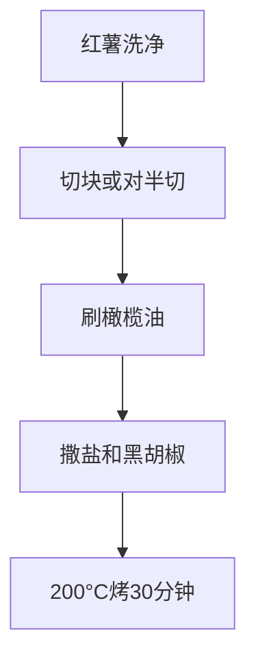
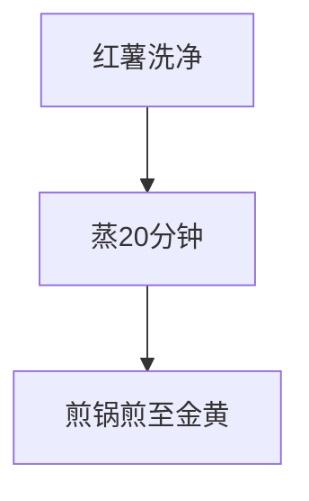

# 烤红薯

> **碳水**：~20g/100g | **热量**：~90kcal/100g | **适合**：午餐/晚餐主食 | **低GI**

---

## 一、用料（1人份）

| 食材 | 用量 | 碳水含量 |
|------|------|---------|
| 红薯 | 200g | ~40g |
| 橄榄油 | 5ml | 0g |
| 盐 | 少许 | 0g |
| 黑胡椒 | 少许 | 0g |
| 迷迭香（可选） | 少许 | 0g |

---

## 二、做法（烤箱版）

**步骤**：
1. **准备红薯**：洗净，可去皮或保留皮
2. **切块**：切成2-3cm的块，或对半切开
3. **调味**：刷上橄榄油，撒盐和黑胡椒
4. **烤制**：烤箱预热200°C，烤30-40分钟至软糯

### 无烤箱方案（电磁炉版）

**步骤**：
1. 红薯洗净，放入蒸锅中蒸20分钟
2. 蒸好后切成小块
3. 平底锅刷油，将红薯块煎至两面金黄

---

## 三、营养成分（约）

| 项目 | 数值（100g） |
|------|-------------|
| 热量 | ~90kcal |
| 碳水 | ~20g |
| 蛋白质 | ~2g |
| 脂肪 | ~0.5g |

---

[返回目录](../README.md)
