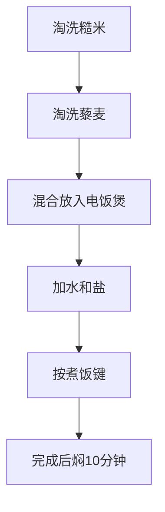

# 糙米藜麦饭

> **碳水**：~45g/100g熟饭 | **热量**：~130kcal/100g | **适合**：午餐/晚餐主食

---

## 一、用料（2人份）

| 食材 | 用量 | 碳水含量 |
|------|------|---------|
| 糙米 | 100g（干） | ~75g |
| 藜麦 | 50g（干） | ~35g |
| 水 | 300ml | 0g |
| 盐 | 少许 | 0g |
| 橄榄油 | 5ml | 0g |

---

## 二、做法

**步骤**：
1. **淘洗食材**：糙米和藜麦分别淘洗干净
2. **混合**：将糙米和藜麦放入电饭煲内胆
3. **加水**：加入300ml水（米水比约1:2）
4. **调味**：加入少许盐和橄榄油
5. **煮饭**：按下煮饭键，约30-40分钟完成
6. **焖饭**：完成后不要立即开盖，焖10分钟

---

## 三、营养成分（约）

| 项目 | 数值（100g熟饭） |
|------|-----------------|
| 热量 | ~130kcal |
| 碳水 | ~45g |
| 蛋白质 | ~4g |
| 脂肪 | ~1g |

---

[返回目录](../README.md)
