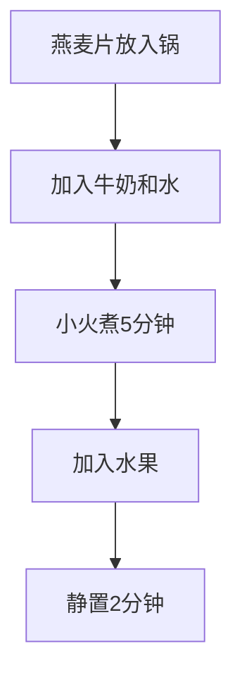

# 燕麦粥

> **碳水**：~25g/100g | **热量**：~110kcal/100g | **适合**：早餐 | **高纤维**

---

## 一、用料（1人份）

| 食材 | 用量 | 碳水含量 |
|------|------|---------|
| 燕麦片（无糖） | 50g | ~40g |
| 牛奶/植物奶 | 200ml | ~10g |
| 水 | 100ml | 0g |
| 香蕉（可选） | 半根 | ~10g |
| 蓝莓（可选） | 50g | ~5g |
| 奇亚籽（可选） | 10g | ~5g |

---

## 二、做法



**步骤**：
1. **准备食材**：燕麦片、牛奶、水放入小锅中
2. **煮制**：小火加热，搅拌均匀，煮5-7分钟至浓稠
3. **加料**：加入切好的香蕉、蓝莓等水果
4. **静置**：关火后静置2分钟，让燕麦吸收水分

### 隔夜燕麦（免煮版）

```cpp
// 适合赶时间的早餐
// 前一晚准备，早上直接吃
```

**步骤**：
1. 燕麦片、牛奶、奇亚籽放入密封罐中
2. 搅拌均匀后放入冰箱冷藏
3. 第二天早上加入水果即可食用

---

## 三、营养成分（约）

| 项目 | 数值（100g） |
|------|-------------|
| 热量 | ~110kcal |
| 碳水 | ~25g |
| 蛋白质 | ~3g |
| 脂肪 | ~2g |

---

[返回目录](../README.md)
