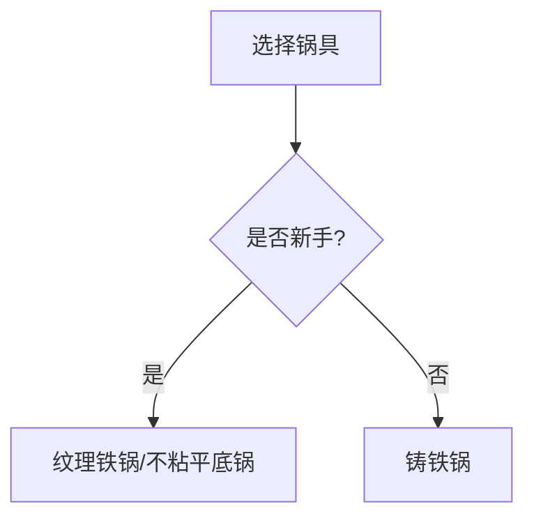
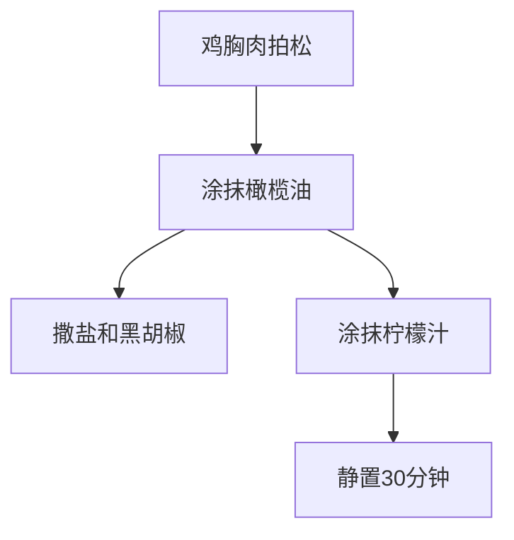
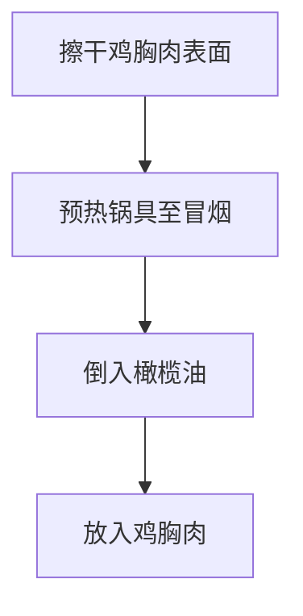
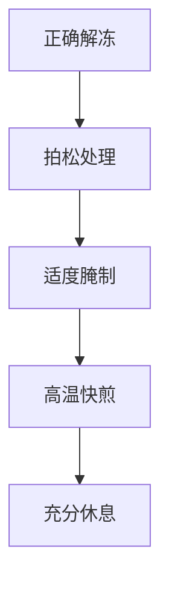

# 香煎鸡胸肉配西兰花

> **蛋白质**：~46g | **热量**：~350kcal | **适合**：午餐/晚餐 | **冻鸡肉适用**

---

## 一、锅具选择

### 推荐锅具对比

| 锅具类型 | 特点 | 推荐指数 | 适用场景 |
|----------|------|---------|---------|
| **纹理铁锅** | 表面有凹凸纹理，物理不粘，适合煎肉 | ⭐⭐⭐⭐⭐ | 煎鸡胸肉首选 |
| **铸铁锅** | 保温性好，加热均匀，美拉德反应佳 | ⭐⭐⭐⭐ | 煎厚切鸡胸 |
| **不粘平底锅** | 表面光滑，易清洁 | ⭐⭐⭐ | 入门级选择 |
| **不锈钢锅** | 导热快，需掌握火候 | ⭐⭐ | 不推荐新手 |

### 锅具选择建议



**核心要点**：
- **纹理铁锅**是煎鸡胸肉的最佳选择，纹理可以形成物理不粘效果，同时帮助锁住肉汁
- 锅具厚度建议选择 **≥3mm**，保证加热均匀

---

## 二、用料（1人份）

| 食材 | 用量 | 蛋白质含量 | 作用 |
|------|------|-----------|------|
| 鸡胸肉（冷冻） | 150g | ~40g | 主蛋白质来源 |
| 西兰花 | 200g | ~6g | 维生素和纤维 |
| 橄榄油 | 10ml | 0g | 锁住水分，增加风味 |
| 大蒜 | 2瓣 | 0g | 增香 |
| 黑胡椒 | 少许 | 0g | 增香 |
| 盐 | 少许 | 0g | 调味，帮助蛋白质收紧 |
| 柠檬 | 半个 | 0g | 嫩化肉质，提味 |
| **可选嫩肉食材** | | | |
| 酸奶/酪乳 | 2汤匙 | ~2g | 乳酸嫩化 |
| 淀粉 | 1茶匙 | 0g | 锁住水分 |
| 蛋清 | 1个 | ~3g | 增加嫩滑感 |

---

## 三、解冻与腌制（关键！）

### 3.1 解冻方法

**方法一：冰箱缓慢解冻（推荐）**


**方法二：冷水快速解冻（应急）**


**注意**：
- ❌ 不要用热水解冻（导致肉汁流失）
- ❌ 不要微波炉解冻（局部过热）

### 3.2 腌制方法（让冻鸡肉变嫩的核心）

#### 基础腌制（适合原味）



**步骤**：
1. 将解冻后的鸡胸肉用肉锤或刀背**轻轻拍松**（厚度均匀，约1.5cm）
2. 两面均匀涂抹橄榄油
3. 撒上盐和黑胡椒，轻轻按摩
4. 挤上柠檬汁，静置**30分钟**

#### 进阶嫩化腌制（冻鸡肉必试）

| 腌料 | 用量 | 作用 |
|------|------|------|
| 酸奶/酪乳 | 2汤匙 | 乳酸分解蛋白质，使肉质更嫩 |
| 柠檬汁 | 1汤匙 | 果酸嫩化 |
| 蒜末 | 1瓣 | 增香 |
| 盐 | 1/4茶匙 | 调味 |

**步骤**：
1. 将酸奶、柠檬汁、蒜末、盐混合均匀
2. 鸡胸肉放入腌料中，冷藏腌制 **2-4小时**（不要超过6小时）
3. 取出后用清水冲洗干净，**彻底擦干表面水分**

### 3.3 快速嫩化技巧（10分钟速成）

```cpp
// 适用于赶时间的情况
// 效果：中等嫩度
```

1. 鸡胸肉拍松后，撒上盐静置 **5分钟**
2. 两面抹上淀粉，静置 **5分钟**
3. 表面刷一层薄油即可煎制

---

## 四、煎制步骤（详细版）

### 准备工作



### 详细步骤

| 步骤 | 操作 | 时间 | 要点 |
|------|------|------|------|
| 1 | 锅具大火预热 | 2-3分钟 | 必须烧至冒烟 |
| 2 | 倒入橄榄油 | - | 油量覆盖锅底即可 |
| 3 | 放入鸡胸肉 | - | 不要立即移动 |
| 4 | 煎第一面 | 3-4分钟 | 形成金黄焦壳 |
| 5 | 翻面煎第二面 | 3-4分钟 | 保持中火 |
| 6 | 转小火盖盖 | 1-2分钟 | 确保内部熟透 |
| 7 | 取出静置 | 3-5分钟 | 让肉汁回流 |

### 关键技巧

1. **预热充分**：锅具必须烧至冒烟，否则容易粘锅
2. **不要频繁翻动**：每面只翻一次，避免肉汁流失
3. **控温**：先用大火定型，再用小火焖熟
4. **静置休息**：煎好后静置3-5分钟，肉汁会重新分布

---

## 五、西兰花处理

### 焯水方法


**步骤**：
1. 西兰花切成小朵，洗净
2. 水烧开，加少许盐
3. 西兰花焯水 **2分钟**（保持翠绿）
4. 捞出后立即放入冷水中（保持脆嫩）

### 炒制方法

```cpp
// 利用煎鸡胸肉剩余的油
// 味道更香
```

1. 煎完鸡胸肉后，锅中留少许底油
2. 放入蒜末爆香
3. 加入西兰花翻炒 **1-2分钟**
4. 加盐调味即可

---

## 六、让冻鸡胸肉变嫩的核心秘诀



### 核心原则总结

| 步骤 | 操作 | 目的 |
|------|------|------|
| **1. 解冻** | 冰箱缓慢解冻 | 保留肉汁 |
| **2. 拍松** | 厚度均匀 | 受热均匀，口感一致 |
| **3. 腌制** | 酸奶/柠檬汁 | 分解蛋白质，增加嫩度 |
| **4. 擦干** | 彻底擦干表面 | 形成漂亮焦壳 |
| **5. 快煎** | 高温快速煎制 | 锁住水分 |
| **6. 休息** | 静置3-5分钟 | 肉汁回流 |

### 常见问题解决

| 问题 | 原因 | 解决方案 |
|------|------|---------|
| 肉质干柴 | 煎制时间过长 | 缩短煎制时间，用小火焖熟 |
| 粘锅 | 锅具未预热 | 锅烧至冒烟再下肉 |
| 内部不熟 | 火力不足 | 适当延长煎制时间 |
| 味道平淡 | 腌制时间不够 | 延长腌制至30分钟以上 |

---

## 七、营养成分（约）

| 项目 | 数值 |
|------|------|
| 热量 | 350kcal |
| 蛋白质 | ~46g |
| 碳水 | ~15g |
| 脂肪 | ~12g |

---

## 八、搭配建议

| 配菜 | 做法 | 热量 |
|------|------|------|
| **烤土豆** | 切块，橄榄油、迷迭香，200°C烤30分钟 | ~80kcal/100g |
| **烤芦笋** | 橄榄油、盐、黑胡椒，200°C烤10分钟 | ~50kcal/100g |
| **蘑菇** | 黄油炒香 | ~30kcal/100g |

---

[返回目录](../README.md)
