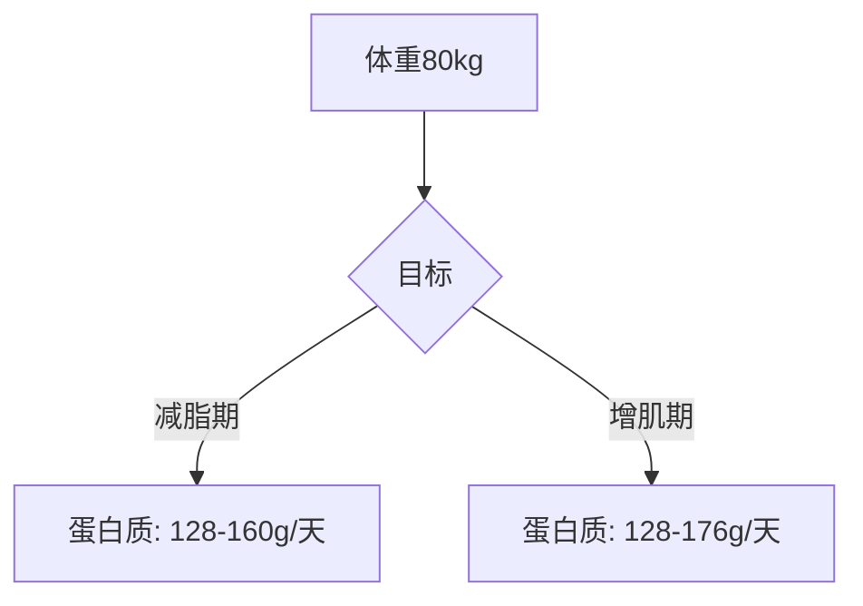
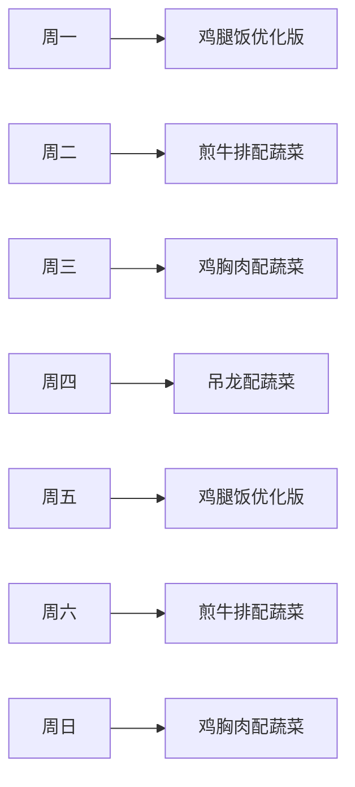

# 个人化健身餐方案

> **基于您的实际饮食情况优化**
> 
> **您的当前饮食**：
> - 🌅 早餐：三明治 + 牛奶250ml（暂时不规划）
> - 🌞 午餐：食堂烧鸭拼鸡腿
> - 🌙 晚餐：沙县鸡腿饭 + 菠菜 + 煎牛排配无菌蛋 / 吊龙 / 鸡胸肉
> 
> **您的体重**：80kg  
> **蛋白质目标**：减脂期 128-160g/天 | 增肌期 128-176g/天

---

## 一、当前晚餐分析

### 1.1 晚餐营养成分表

| 食物 | 蛋白质 | 碳水 | 脂肪 | 热量 |
|------|-------|------|------|------|
| 鸡腿1个（去皮） | ~25g | ~0g | ~10g | ~180kcal |
| 白米饭200g | ~5g | ~55g | ~0g | ~210kcal |
| 菠菜100g | ~3g | ~4g | ~0.5g | ~25kcal |
| 牛排150g（中等熟） | ~40g | ~0g | ~15g | ~300kcal |
| 无菌蛋1个 | ~6g | ~0g | ~5g | ~70kcal |
| **合计（鸡腿饭+菠菜+牛排+蛋）** | **~79g** | **~59g** | **~30.5g** | **~785kcal** |

### 1.2 评价与建议

| 维度 | 评价 | 建议 |
|------|------|------|
| 蛋白质 | ⭐⭐⭐⭐ | 充足，可以维持 |
| 碳水 | ⭐⭐ | 白米饭偏多，建议替换 |
| 脂肪 | ⭐⭐⭐ | 牛排脂肪适中 |
| 蔬菜 | ⭐⭐⭐ | 菠菜很好，可以增加种类 |

---

## 二、针对80kg体重的晚餐计划

### 2.1 目标设定

### 2.2 晚餐蛋白质目标

| 目标 | 每日蛋白质 | 晚餐占比 | 晚餐目标 |
|------|-----------|---------|---------|
| 减脂期 | 128-160g | ~30% | **38-48g** |
| 增肌期 | 128-176g | ~30% | **38-53g** |

---

## 三、晚餐方案选择

### 3.1 方案一：鸡腿饭优化版（推荐减脂期）

| 食材 | 用量 | 蛋白质 | 碳水 | 热量 |
|------|------|-------|------|------|
| 鸡腿1个（去皮） | ~150g | ~30g | ~0g | ~220kcal |
| [糙米藜麦饭](../carbs-brown-rice-quinoa/) | 100g | ~4g | ~45g | ~130kcal |
| 菠菜 | 150g | ~4g | ~6g | ~35kcal |
| 无菌蛋1个 | 1个 | ~6g | ~0g | ~70kcal |
| **合计** | | **~44g** | **~51g** | **~455kcal** |

**做法**：
1. 沙县鸡腿去皮（减少脂肪）
2. 米饭替换为糙米藜麦饭（减少碳水，增加纤维）
3. 增加菠菜份量
4. 加一个无菌蛋增加蛋白质

### 3.2 方案二：煎牛排配蔬菜（推荐增肌期）

| 食材 | 用量 | 蛋白质 | 碳水 | 热量 |
|------|------|-------|------|------|
| 牛排（西冷/眼肉） | 150g | ~40g | ~0g | ~300kcal |
| [烤红薯](../carbs-baked-sweet-potato/) | 150g | ~3g | ~30g | ~135kcal |
| 菠菜 | 100g | ~3g | ~4g | ~25kcal |
| 无菌蛋1个 | 1个 | ~6g | ~0g | ~70kcal |
| **合计** | | **~52g** | **~34g** | **~530kcal** |

**做法**：
1. 牛排按喜欢的熟度煎制
2. 红薯提前烤好或蒸熟
3. 菠菜焯水或快炒
4. 无菌蛋煎至半熟

### 3.3 方案三：吊龙配蔬菜（推荐增肌期）

| 食材 | 用量 | 蛋白质 | 碳水 | 热量 |
|------|------|-------|------|------|
| 吊龙牛肉 | 150g | ~42g | ~0g | ~280kcal |
| [糙米藜麦饭](../carbs-brown-rice-quinoa/) | 100g | ~4g | ~45g | ~130kcal |
| 西兰花 | 100g | ~3g | ~6g | ~30kcal |
| 无菌蛋1个 | 1个 | ~6g | ~0g | ~70kcal |
| **合计** | | **~55g** | **~51g** | **~510kcal** |

**做法**：
1. 吊龙切片，用少许油快炒至变色
2. 西兰花焯水或快炒
3. 搭配糙米藜麦饭

### 3.4 方案四：鸡胸肉配蔬菜（推荐减脂期）

| 食材 | 用量 | 蛋白质 | 碳水 | 热量 |
|------|------|-------|------|------|
| 鸡胸肉 | 150g | ~40g | ~0g | ~165kcal |
| [烤红薯](../carbs-baked-sweet-potato/) | 150g | ~3g | ~30g | ~135kcal |
| 菠菜+番茄 | 各100g | ~3g | ~8g | ~40kcal |
| **合计** | | **~46g** | **~38g** | **~340kcal** |

**做法**：
1. 鸡胸肉煎制或烤制
2. 红薯提前准备
3. 蔬菜简单快炒

---

## 四、晚餐方案对比

| 方案 | 蛋白质 | 碳水 | 热量 | 适合目标 |
|------|-------|------|------|---------|
| 鸡腿饭优化版 | ~44g | ~51g | ~455kcal | ✅ 减脂期 |
| 煎牛排配蔬菜 | ~52g | ~34g | ~530kcal | ✅ 增肌期 |
| 吊龙配蔬菜 | ~55g | ~51g | ~510kcal | ✅ 增肌期 |
| 鸡胸肉配蔬菜 | ~46g | ~38g | ~340kcal | ✅ 减脂期 |

---

## 五、一周晚餐计划示例

| 日期 | 晚餐方案 | 蛋白质 |
|------|---------|-------|
| 周一 | 鸡腿饭优化版 | ~44g |
| 周二 | 煎牛排配蔬菜 | ~52g |
| 周三 | 鸡胸肉配蔬菜 | ~46g |
| 周四 | 吊龙配蔬菜 | ~55g |
| 周五 | 鸡腿饭优化版 | ~44g |
| 周六 | 煎牛排配蔬菜 | ~52g |
| 周日 | 鸡胸肉配蔬菜 | ~46g |
| **周合计** | | **~339g** |

---

## 六、主食替换建议

| 当前主食 | 替换为 | 效果 |
|----------|--------|------|
| 白米饭200g | [糙米藜麦饭](../carbs-brown-rice-quinoa/) 100g | 碳水-10g，纤维+ |
| 白米饭200g | [烤红薯](../carbs-baked-sweet-potato/) 150g | 碳水-25g，低GI |

---

## 七、注意事项

1. **蛋白质摄入**：根据您80kg体重，晚餐建议摄入 **38-53g蛋白质**
2. **主食选择**：减脂期建议选择糙米藜麦饭或烤红薯，控制份量在100-150g
3. **蔬菜摄入**：建议每餐蔬菜量在100-200g，可以多样化
4. **烹饪方式**：优先选择蒸、煮、烤、快炒，减少油炸和红烧

---

[返回目录](../README.md)
