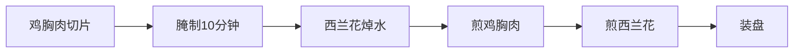

# 高蛋白健身餐食谱

> **适用场景**：增肌期、减脂期、日常健康饮食  
> **核心原则**：高蛋白、优质碳水、健康脂肪  
> **蛋白质来源**：鸡胸肉、三文鱼、虾、鸡蛋、豆腐、希腊酸奶等

---

## 目录

1. [香煎鸡胸肉配西兰花](#1-香煎鸡胸肉配西兰花)
2. [三文鱼牛油果沙拉](#2-三文鱼牛油果沙拉)
3. [虾仁蔬菜炒蛋白](#3-虾仁蔬菜炒蛋白)
4. [希腊酸奶莓果碗](#4-希腊酸奶莓果碗)
5. [豆腐藜麦蔬菜碗](#5-豆腐藜麦蔬菜碗)
6. [火鸡肉蔬菜卷](#6-火鸡肉蔬菜卷)
7. [金枪鱼蔬菜沙拉](#7-金枪鱼蔬菜沙拉)
8. [鸡蛋蔬菜欧姆蛋](#8-鸡蛋蔬菜欧姆蛋)

---

## 1. 香煎鸡胸肉配西兰花

### 用料（1人份）

| 食材 | 用量 | 蛋白质含量 |
|------|------|-----------|
| 鸡胸肉 | 150g | ~40g |
| 西兰花 | 200g | ~6g |
| 橄榄油 | 10ml | 0g |
| 大蒜 | 2瓣 | 0g |
| 黑胡椒 | 少许 | 0g |
| 盐 | 少许 | 0g |
| 柠檬 | 半个 | 0g |

### 做法

1. **准备工作**：鸡胸肉切成1.5cm厚的片，用盐、黑胡椒、柠檬汁腌制10分钟
2. **西兰花处理**：水烧开，加少许盐，西兰花焯水2分钟后捞出沥干
3. **煎制鸡胸**：热锅倒入橄榄油，中火将鸡胸肉煎至两面金黄（每面约3分钟），最后转小火煎1分钟
4. **炒制西兰花**：用锅中剩余的油，放入蒜末爆香，加入西兰花翻炒，加盐调味
5. **装盘**：鸡胸肉切条，搭配西兰花，可淋少许柠檬汁

### 营养成分（约）

| 项目 | 数值 |
|------|------|
| 热量 | 350kcal |
| 蛋白质 | ~46g |
| 碳水 | ~15g |
| 脂肪 | ~12g |

---

## 2. 三文鱼牛油果沙拉

### 用料（1人份）

| 食材 | 用量 | 蛋白质含量 |
|------|------|-----------|
| 三文鱼排 | 120g | ~30g |
| 牛油果 | 半个 | ~2g |
| 混合生菜 | 100g | ~2g |
| 樱桃番茄 | 5颗 | ~1g |
| 黄瓜 | 50g | ~1g |
| 橄榄油 | 15ml | 0g |
| 柠檬汁 | 15ml | 0g |
| 蜂蜜 | 5ml | 0g |
| 黑胡椒 | 少许 | 0g |

### 做法

1. **三文鱼处理**：三文鱼排用盐、黑胡椒腌制5分钟，烤箱预热200°C，烤12-15分钟
2. **准备蔬菜**：生菜撕成小片，樱桃番茄对半切，黄瓜切片，牛油果切块
3. **制作酱汁**：橄榄油、柠檬汁、蜂蜜混合拌匀
4. **组装沙拉**：生菜铺底，放上番茄、黄瓜、牛油果，烤好的三文鱼切块放在上面
5. **淋酱**：浇上调制好的酱汁，撒少许黑胡椒

### 营养成分（约）

| 项目 | 数值 |
|------|------|
| 热量 | 420kcal |
| 蛋白质 | ~35g |
| 碳水 | ~12g |
| 脂肪 | ~28g |

---

## 3. 虾仁蔬菜炒蛋白

### 用料（1人份）

| 食材 | 用量 | 蛋白质含量 |
|------|------|-----------|
| 鲜虾仁 | 150g | ~25g |
| 鸡蛋 | 3个（仅蛋白） | ~18g |
| 西兰花 | 100g | ~3g |
| 胡萝卜 | 50g | ~1g |
| 荷兰豆 | 50g | ~2g |
| 橄榄油 | 10ml | 0g |
| 盐 | 少许 | 0g |
| 白胡椒 | 少许 | 0g |

### 做法

1. **准备食材**：虾仁用盐、白胡椒腌制5分钟；西兰花、胡萝卜、荷兰豆洗净切好
2. **炒制蔬菜**：热锅倒油，先炒胡萝卜1分钟，再加入西兰花和荷兰豆翻炒2分钟
3. **煎蛋白**：另起一锅，倒入蛋白液，小火煎至凝固后用铲子切成小块
4. **混合炒制**：将炒好的蔬菜和虾仁加入蛋白锅中，快速翻炒均匀，加盐调味

### 营养成分（约）

| 项目 | 数值 |
|------|------|
| 热量 | 280kcal |
| 蛋白质 | ~49g |
| 碳水 | ~10g |
| 脂肪 | ~10g |

---

## 4. 希腊酸奶莓果碗

### 用料（1人份）

| 食材 | 用量 | 蛋白质含量 |
|------|------|-----------|
| 希腊酸奶（无糖） | 200g | ~20g |
| 草莓 | 100g | ~1g |
| 蓝莓 | 50g | ~1g |
| 杏仁 | 10颗 | ~2g |
| 奇亚籽 | 10g | ~2g |
| 燕麦片 | 30g | ~3g |
| 蜂蜜（可选） | 5ml | 0g |

### 做法

1. **准备基底**：碗中倒入希腊酸奶
2. **添加水果**：草莓切块，和蓝莓一起均匀铺在酸奶上
3. **添加谷物**：撒上燕麦片和奇亚籽
4. **点缀坚果**：放上杏仁
5. **调味**：可淋少许蜂蜜（减脂期建议省略）

### 营养成分（约）

| 项目 | 数值 |
|------|------|
| 热量 | 320kcal |
| 蛋白质 | ~28g |
| 碳水 | ~35g |
| 脂肪 | ~12g |

---

## 5. 豆腐藜麦蔬菜碗

### 用料（1人份）

| 食材 | 用量 | 蛋白质含量 |
|------|------|-----------|
| 嫩豆腐 | 200g | ~15g |
| 藜麦 | 50g（干） | ~4g |
| 西兰花 | 100g | ~3g |
| 小番茄 | 5颗 | ~1g |
| 玉米粒 | 50g | ~2g |
| 酱油 | 10ml | 0g |
| 蒜末 | 1瓣 | 0g |
| 香油 | 5ml | 0g |

### 做法

1. **煮藜麦**：藜麦淘洗干净，加水煮15-20分钟至熟
2. **准备蔬菜**：西兰花焯水2分钟，小番茄对半切
3. **煎豆腐**：豆腐切小块，平底锅刷油，煎至两面金黄
4. **调制酱汁**：酱油、蒜末、香油混合拌匀
5. **组装碗**：藜麦铺底，放上豆腐、西兰花、番茄、玉米粒，淋上酱汁

### 营养成分（约）

| 项目 | 数值 |
|------|------|
| 热量 | 300kcal |
| 蛋白质 | ~25g |
| 碳水 | ~40g |
| 脂肪 | ~8g |

---

## 6. 火鸡肉蔬菜卷

### 用料（1人份）

| 食材 | 用量 | 蛋白质含量 |
|------|------|-----------|
| 火鸡胸肉 | 100g | ~25g |
| 全麦卷饼 | 1张 | ~5g |
| 生菜 | 3片 | ~1g |
| 番茄 | 半个 | ~1g |
| 黄瓜 | 30g | ~1g |
| 低脂奶酪 | 20g | ~5g |
| 芥末酱 | 5g | 0g |

### 做法

1. **准备馅料**：火鸡胸肉切片，生菜切丝，番茄和黄瓜切片
2. **加热卷饼**：平底锅小火加热卷饼至变软
3. **组装卷饼**：卷饼上铺生菜丝，放上火鸡肉、番茄、黄瓜，撒奶酪丝，挤少许芥末酱
4. **卷起来**：从一端卷紧，可切半食用

### 营养成分（约）

| 项目 | 数值 |
|------|------|
| 热量 | 380kcal |
| 蛋白质 | ~37g |
| 碳水 | ~35g |
| 脂肪 | ~12g |

---

## 7. 金枪鱼蔬菜沙拉

### 用料（1人份）

| 食材 | 用量 | 蛋白质含量 |
|------|------|-----------|
| 水浸金枪鱼罐头 | 1罐（180g） | ~35g |
| 混合生菜 | 150g | ~3g |
| 牛油果 | 半个 | ~2g |
| 鸡蛋 | 1个（煮熟） | ~6g |
| 黑橄榄 | 5颗 | ~1g |
| 橄榄油 | 10ml | 0g |
| 香醋 | 10ml | 0g |
| 盐、黑胡椒 | 少许 | 0g |

### 做法

1. **准备蔬菜**：生菜撕成小片，牛油果切块，鸡蛋切片，黑橄榄切圈
2. **处理金枪鱼**：打开罐头，沥干水分，用叉子将鱼肉拨散
3. **制作酱汁**：橄榄油、香醋、盐、黑胡椒混合拌匀
4. **组装沙拉**：生菜铺底，放上牛油果、鸡蛋、黑橄榄，金枪鱼放在最上面
5. **淋酱**：浇上调制好的酱汁

### 营养成分（约）

| 项目 | 数值 |
|------|------|
| 热量 | 400kcal |
| 蛋白质 | ~47g |
| 碳水 | ~8g |
| 脂肪 | ~25g |

---

## 8. 鸡蛋蔬菜欧姆蛋

### 用料（1人份）

| 食材 | 用量 | 蛋白质含量 |
|------|------|-----------|
| 鸡蛋 | 4个 | ~24g |
| 菠菜 | 100g | ~3g |
| 蘑菇 | 50g | ~2g |
| 洋葱 | 30g | ~1g |
| 低脂牛奶 | 30ml | ~2g |
| 橄榄油 | 5ml | 0g |
| 盐、黑胡椒 | 少许 | 0g |

### 做法

1. **准备食材**：菠菜焯水切碎，蘑菇切片，洋葱切丝
2. **调制蛋液**：鸡蛋打入碗中，加入牛奶、盐、黑胡椒，搅拌均匀
3. **炒制蔬菜**：热锅倒油，洋葱爆香，加入蘑菇翻炒至软，加入菠菜翻炒均匀
4. **煎制欧姆蛋**：倒入蛋液，小火慢慢煎至边缘凝固，从一侧向另一侧卷成蛋卷
5. **出锅**：装盘后可撒少许黑胡椒

### 营养成分（约）

| 项目 | 数值 |
|------|------|
| 热量 | 320kcal |
| 蛋白质 | ~32g |
| 碳水 | ~8g |
| 脂肪 | ~20g |

---

## 健身餐饮食建议

### 蛋白质摄入量参考

| 目标 | 每日蛋白质摄入量 |
|------|----------------|
| 维持体重 | 1.0-1.2g/kg体重 |
| 增肌 | 1.6-2.2g/kg体重 |
| 减脂 | 1.6-2.0g/kg体重 |

### 食材选择原则

1. **蛋白质**：优先选择鸡胸肉、鱼肉、虾、鸡蛋、低脂乳制品、豆制品
2. **碳水**：糙米、藜麦、燕麦、红薯、全麦面包
3. **脂肪**：牛油果、坚果、橄榄油、深海鱼油
4. **蔬菜**：西兰花、菠菜、芦笋、黄瓜、番茄

### 烹饪方式建议

- ✅ 推荐：蒸、煮、烤、快炒
- ❌ 避免：油炸、红烧、长时间炖煮

---

## 修订记录

| 日期 | 变更 |
|------|------|
| 2026-05-28 | 初版：8道高蛋白健身餐食谱 |

---

> **注意**：以上食谱为通用建议，具体用量可根据个人身体状况和目标调整。如有特殊健康问题，请咨询专业营养师。
