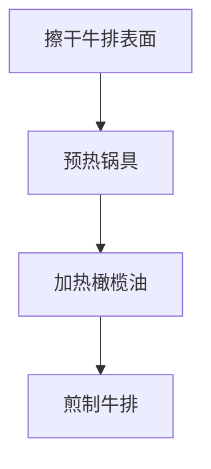
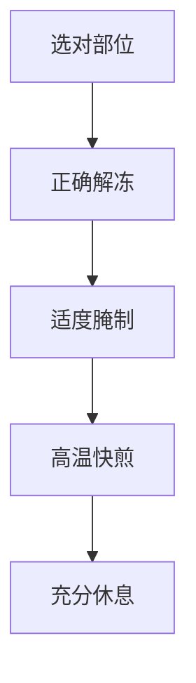

# 香煎牛排

> **蛋白质**：~40-50g（150g牛排） | **热量**：~450kcal | **适合**：晚餐 | **高蛋白增肌**

---

## 一、牛排部位选择

### 推荐部位对比

| 部位 | 特点 | 口感 | 适合烹饪方式 | 蛋白质含量 |
|------|------|------|-------------|-----------|
| **西冷牛排（Sirloin）** | 外脊肉，有筋膜 | 有嚼劲，肉香浓郁 | 煎、烤 | ~28g/100g |
| **菲力牛排（Filet Mignon）** | 牛里脊，最嫩部位 | 极嫩，口感细腻 | 煎、烤 | ~30g/100g |
| **眼肉牛排（Ribeye）** | 肋眼部位，带大理石花纹 | 多汁，脂肪均匀 | 煎、烤 | ~26g/100g |
| **T骨牛排（T-Bone）** | 西冷+菲力组合 | 双重口感 | 煎、烤 | ~27g/100g |
| **纽约客（New York Strip）** | 西冷的一种，肉质紧实 | 有嚼劲，风味足 | 煎、烤 | ~28g/100g |

### 部位选择建议

- **追求极致嫩度**：选择 **菲力牛排**
- **追求风味浓郁**：选择 **眼肉牛排**
- **均衡口感**：选择 **西冷牛排**

---

## 二、解冻方法（关键！）

### 推荐方法：冰箱缓慢解冻（最佳）


**步骤**：
1. 将冷冻牛排从冷冻层取出，放入冰箱冷藏室
2. 解冻时间：2cm厚牛排约24小时，3cm厚约48小时
3. 解冻完成后，提前30分钟取出至室温

### 快速解冻方法（应急用）


**注意**：
- ❌ 不要用热水解冻（会导致肉汁流失）
- ❌ 不要直接常温解冻（表面易滋生细菌）

---

## 三、腌制方法（让肉质更嫩）

### 基础腌制（适合原味爱好者）

| 食材 | 用量（1块牛排） | 作用 |
|------|----------------|------|
| 橄榄油 | 1汤匙 | 锁住水分，增加风味 |
| 盐 | 1/2茶匙 | 调味，帮助蛋白质收紧 |
| 黑胡椒 | 适量 | 增香 |
| 大蒜粉 | 1/4茶匙 | 增香（可选） |
| 迷迭香/百里香 | 少许 | 增香（可选） |

**步骤**：
1. 牛排解冻后，用厨房纸巾**彻底擦干表面水分**
2. 在牛排两面均匀涂抹橄榄油
3. 撒上盐和黑胡椒，轻轻按压让调料渗入
4. 静置腌制 **30分钟**（不要超过1小时，以免肉质变咸）

### 进阶腌制（让肉质更嫩）

```cpp
// 嫩肉技巧：使用酸性物质
// 注意：腌制时间不宜过长，否则肉质会变松散
```

| 食材 | 用量 | 作用 |
|------|------|------|
| 酸奶/酪乳 | 1/4杯 | 乳酸软化肉质 |
| 柠檬汁 | 1汤匙 | 果酸嫩化 |
| 蒜末 | 2瓣 | 增香 |
| 盐 | 1/2茶匙 | 调味 |

**步骤**：
1. 将酸奶、柠檬汁、蒜末、盐混合均匀
2. 牛排放入腌料中，冷藏腌制 **2-4小时**（不要超过6小时）
3. 取出后用清水冲洗干净，擦干水分

---

## 四、煎制步骤（关键技巧）

### 准备工作



### 详细步骤

1. **预热锅具**：
   - 使用**铸铁锅**或**厚底平底锅**
   - 大火预热至锅具冒烟（约2-3分钟）

2. **煎制过程**：

| 步骤 | 操作 | 时间 | 要点 |
|------|------|------|------|
| 1 | 放入牛排，不要移动 | 3-4分钟/面 | 形成美拉德反应外壳 |
| 2 | 翻面，继续煎制 | 3-4分钟/面 | 保持大火 |
| 3 | 加入黄油和香草 | 1-2分钟 | 淋油增香 |
| 4 | 静置休息 | 5-10分钟 | 让肉汁回流 |

3. **加入黄油增香**：
   ```cpp
   // 煎至最后1-2分钟时
   // 放入黄油、大蒜、迷迭香
   // 用勺子将融化的黄油淋在牛排上
   ```

4. **静置休息**：
   - 将牛排取出放在盘子上
   - 用锡纸轻轻盖住
   - 静置 **5-10分钟**（厚度2cm的牛排）

---

## 五、熟度判断

### 温度参考

| 熟度 | 内部温度 | 描述 |
|------|---------|------|
| 三分熟（Rare） | 52-55°C | 中心粉红色，外层褐色 |
| 五分熟（Medium Rare） | 55-60°C | 中心粉红色，边缘灰色 |
| 七分熟（Medium） | 60-65°C | 中心淡粉色，大部分灰色 |
| 全熟（Well Done） | 70°C以上 | 完全灰色，口感较硬 |

### 按压判断法

| 手感 | 熟度 |
|------|------|
| 像按嘴唇一样软 | 三分熟 |
| 像按鼻尖一样有弹性 | 五分熟 |
| 像按额头一样硬 | 全熟 |

---

## 六、搭配建议

### 经典搭配

| 配菜 | 做法 | 热量 |
|------|------|------|
| **烤芦笋** | 橄榄油、盐、黑胡椒，200°C烤10分钟 | ~50kcal/100g |
| **烤土豆** | 切块，橄榄油、迷迭香，200°C烤30分钟 | ~80kcal/100g |
| **蘑菇** | 黄油炒香 | ~30kcal/100g |
| **红酒汁** | 红酒、洋葱、牛肉高汤熬制 | ~20kcal/100g |

---

## 七、让肉质更嫩的秘诀



### 关键技巧总结

1. **选对部位**：菲力最嫩，其次是眼肉
2. **正确解冻**：冰箱缓慢解冻，保留肉汁
3. **擦干水分**：煎制前务必擦干，才能形成漂亮的焦壳
4. **高温快煎**：大火快速煎制，锁住水分
5. **充分休息**：静置让肉汁回流，口感更嫩
6. **不要过度翻动**：每面只翻一次，避免肉汁流失

---

## 八、营养成分（150g西冷牛排）

| 项目 | 数值 |
|------|------|
| 热量 | ~450kcal |
| 蛋白质 | ~42g |
| 碳水 | 0g |
| 脂肪 | ~30g |

---

[返回目录](../README.md)
