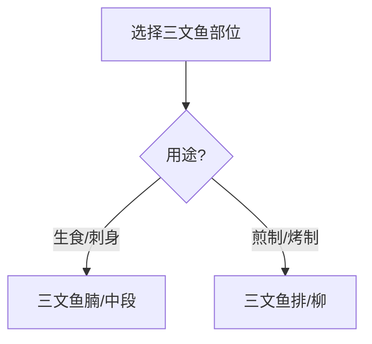
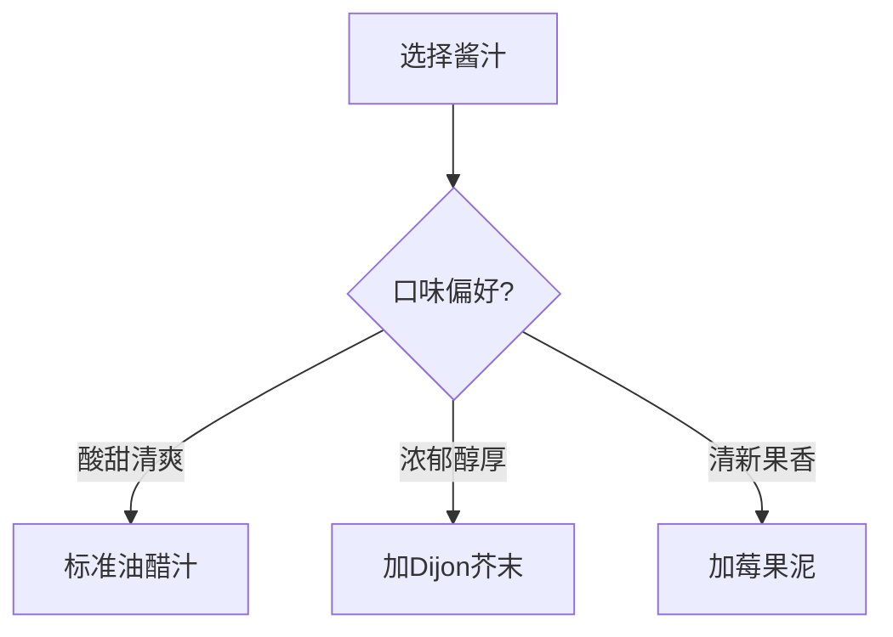
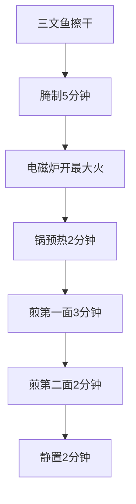
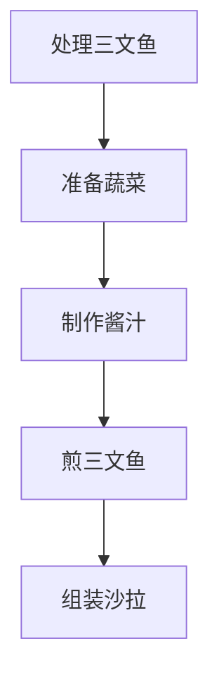

# 三文鱼牛油果沙拉

> **蛋白质**：~35g | **热量**：~420kcal | **适合**：午餐/晚餐 | **富含Omega-3** | **电磁炉适用**

---

## 一、三文鱼部位选择

### 推荐部位对比

| 部位 | 特点 | 口感 | 适合烹饪方式 | 是否适合生食 |
|------|------|------|-------------|------------|
| **三文鱼排（中段）** | 背部肉，脂肪均匀，肉质饱满 | 肥美多汁 | 煎、烤、生食 | ✅ |
| **三文鱼腩** | 腹部肉，脂肪含量高 | 极其肥美 | 生食、炙烤 | ✅ |
| **三文鱼尾** | 尾部肉，肉质较紧实 | 有嚼劲 | 煎、炖 | ❌（不适合生食） |
| **三文鱼柳** | 去皮去骨的纯肉 | 细嫩 | 煎、蒸 | ✅ |

### 部位选择建议



**核心要点**：
- **三文鱼排（中段）**是最常用的部位，兼顾口感和性价比
- 用于沙拉建议选择**中段或鱼柳**，厚度约2-3cm

---

## 二、三文鱼为什么可以生吃？

### 生食三文鱼的条件


**原因**：
1. **冷链运输**：从捕捞到餐桌全程冷链，保证新鲜
2. **冷冻处理**：大部分生食三文鱼会经过-20°C冷冻7天以上，杀死寄生虫
3. **严格检验**：符合食品安全标准的三文鱼会有专门的生食认证

### 注意事项

| 情况 | 是否可生食 | 原因 |
|------|-----------|------|
| 正规超市购买的三文鱼排 | ✅ | 通常经过冷冻处理 |
| 自己捕捞的三文鱼 | ❌ | 无法保证寄生虫安全 |
| 已经烹饪过的三文鱼 | ❌ | 二次生食有风险 |

---

## 三、用料（1人份）

| 食材 | 用量 | 蛋白质含量 | 作用 |
|------|------|-----------|------|
| 三文鱼排（中段） | 120g | ~30g | 主蛋白质来源 |
| 牛油果 | 半个 | ~2g | 健康脂肪 |
| 混合生菜 | 100g | ~2g | 纤维和维生素 |
| 樱桃番茄 | 5颗 | ~1g | 维生素C |
| 黄瓜 | 50g | ~1g | 清爽口感 |
| **酱汁材料** | | | |
| 橄榄油 | 3汤匙（45ml） | 0g | 基底油 |
| 柠檬汁 | 1汤匙（15ml） | 0g | 酸味来源 |
| 蜂蜜 | 1茶匙（5ml） | 0g | 甜味来源 |
| 盐 | 1/4茶匙 | 0g | 调味 |
| 黑胡椒 | 少许 | 0g | 增香 |

---

## 四、酱汁详细比例与替代方案

### 4.1 标准酱汁配方（油醋汁）

| 成分 | 用量 | 比例 |
|------|------|------|
| 橄榄油 | 3份 | 60% |
| 柠檬汁 | 1份 | 20% |
| 蜂蜜 | 1/3份 | 7% |
| 盐 | 少许 | - |
| 黑胡椒 | 少许 | - |

**调制方法**：
1. 将橄榄油、柠檬汁、蜂蜜放入碗中
2. 加入盐和黑胡椒
3. 用打蛋器或叉子充分搅拌至乳化

### 4.2 蜂蜜替代方案

| 替代食材 | 用量 | 效果 |
|----------|------|------|
| **枫糖浆** | 1茶匙 | 类似甜味，更清爽 |
| **龙舌兰糖浆** | 1茶匙 | 低GI，适合控糖 |
| **苹果醋** | 1/2茶匙 | 增加酸度，减少甜味 |
| **Dijon芥末酱** | 1/2茶匙 | 增加风味层次 |
| **省略** | - | 纯油醋汁，酸甜平衡 |

### 4.3 不同口味酱汁



---

## 五、三文鱼烹饪方法（无烤箱方案）

### 5.1 电磁炉煎制（2200W最大火力）



**详细步骤**：

| 步骤 | 操作 | 时间 | 要点 |
|------|------|------|------|
| 1 | 三文鱼擦干表面水分 | - | 必须彻底擦干 |
| 2 | 撒盐和黑胡椒腌制 | 5分钟 | 简单调味即可 |
| 3 | 电磁炉开最大火（2200W） | - | 火力全开 |
| 4 | 锅具预热 | 2分钟 | 烧至冒烟 |
| 5 | 放入三文鱼（皮朝下） | - | 不要立即移动 |
| 6 | 煎第一面 | 3分钟 | 形成金黄焦壳 |
| 7 | 翻面煎第二面 | 2分钟 | 保持大火 |
| 8 | 取出静置 | 2分钟 | 让肉汁回流 |

### 5.2 生食方案（无需烹饪）

**适合人群**：喜欢生食口感的朋友

```cpp
// 生食三文鱼处理步骤
// 注意：必须使用可生食级别的三文鱼
```

**步骤**：
1. 三文鱼用厨房纸巾擦干
2. 切成1cm厚的片或小块
3. 可蘸取酱油+芥末食用
4. 直接加入沙拉中

---

## 六、完整做法（电磁炉版）

### 准备工作



### 详细步骤

1. **处理三文鱼**：
   - 三文鱼排用厨房纸巾**彻底擦干**
   - 撒上盐和黑胡椒，静置腌制 **5分钟**

2. **准备蔬菜**：
   - 生菜撕成小片
   - 樱桃番茄对半切
   - 黄瓜切片
   - 牛油果切块

3. **制作酱汁**：
   - 橄榄油、柠檬汁、蜂蜜按 **3:1:0.3** 比例混合
   - 加入盐和黑胡椒，搅拌至乳化

4. **煎三文鱼（电磁炉2200W）**：
   - 电磁炉开最大火，锅预热 **2分钟**
   - 放入三文鱼（皮朝下），煎 **3分钟**
   - 翻面煎第二面 **2分钟**
   - 取出静置 **2分钟**，切成小块

5. **组装沙拉**：
   - 生菜铺底
   - 放上番茄、黄瓜、牛油果
   - 三文鱼块放在最上面
   - 淋上酱汁，撒少许黑胡椒

---

## 七、电磁炉使用技巧

### 火力控制

| 阶段 | 火力设置 | 原因 |
|------|---------|------|
| 预热锅具 | 2200W（最大） | 快速达到高温 |
| 煎制三文鱼 | 2200W（最大） | 形成美拉德反应 |
| 煎制蔬菜 | 1200-1500W | 避免过度焦糊 |

### 锅具选择

| 锅具类型 | 推荐指数 | 原因 |
|----------|---------|------|
| **铸铁锅** | ⭐⭐⭐⭐⭐ | 保温性好，加热均匀 |
| **不锈钢锅** | ⭐⭐⭐⭐ | 导热快，适合高温 |
| **不粘锅** | ⭐⭐⭐ | 易清洁，适合新手 |

---

## 八、常见问题解答

### Q1：三文鱼有腥味怎么办？

**解决方案**：
- 用柠檬汁或白葡萄酒腌制10分钟
- 煎制时加入姜片或迷迭香
- 确保三文鱼新鲜

### Q2：酱汁分层怎么办？

**解决方案**：
- 调制时充分搅拌至乳化
- 可以加入少许芥末酱帮助乳化
- 上桌前再次搅拌

### Q3：牛油果容易变黑怎么办？

**解决方案**：
- 切开后立即涂抹柠檬汁
- 用保鲜膜包裹时挤出空气
- 尽快食用

---

## 九、营养成分（约）

| 项目 | 数值 |
|------|------|
| 热量 | 420kcal |
| 蛋白质 | ~35g |
| 碳水 | ~12g |
| 脂肪 | ~28g |

---

## 十、搭配建议

| 配菜 | 做法 | 热量 |
|------|------|------|
| **烤土豆** | 切块，橄榄油、迷迭香，200°C烤30分钟 | ~80kcal/100g |
| **藜麦饭** | 藜麦+水=1:2，煮15分钟 | ~120kcal/100g |
| **清蒸芦笋** | 水烧开蒸5分钟 | ~25kcal/100g |

---

[返回目录](../README.md)
