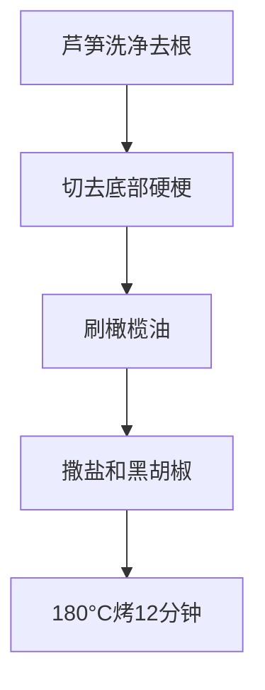
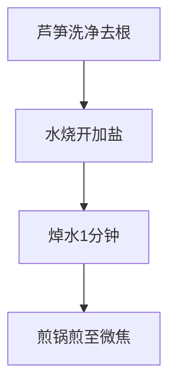
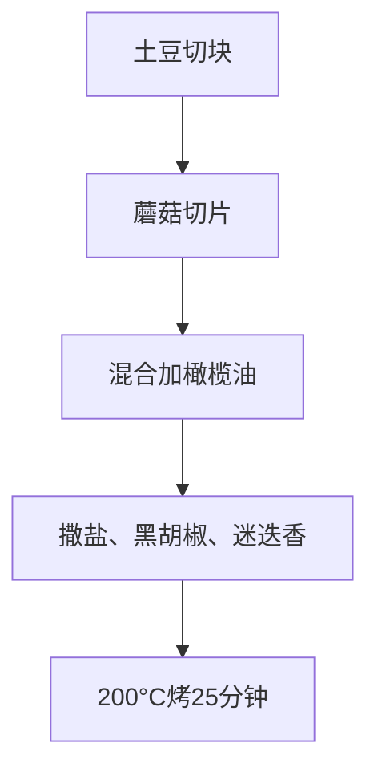
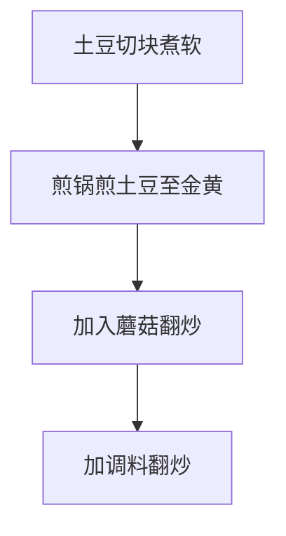
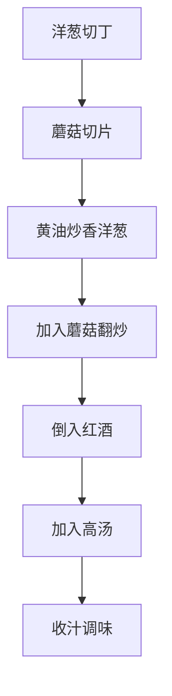
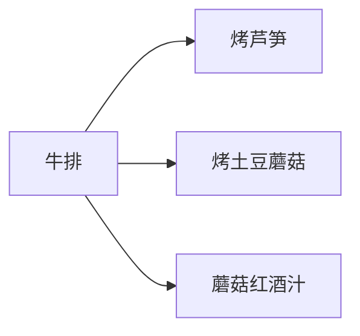

# 健身餐配菜做法

> **搭配建议**：适合与牛排、鸡胸肉、三文鱼等主菜搭配  
> **核心原则**：简单健康、低卡高纤维

---

## 一、烤芦笋

> **热量**：~25kcal/100g | **适合**：牛排/鸡胸肉配菜 | **无烤箱可用煎锅**

### 用料（2人份）

| 食材 | 用量 | 热量 |
|------|------|------|
| 芦笋 | 200g | ~50kcal |
| 橄榄油 | 10ml | ~90kcal |
| 盐 | 少许 | 0kcal |
| 黑胡椒 | 少许 | 0kcal |
| 大蒜粉（可选） | 少许 | 0kcal |

### 做法（烤箱版）



**步骤**：
1. **处理芦笋**：洗净，切去底部2-3cm硬梗
2. **调味**：均匀刷上橄榄油，撒盐和黑胡椒
3. **烤制**：烤箱预热180°C，烤12-15分钟至翠绿微焦

### 做法（电磁炉版/无烤箱）



**步骤**：
1. 芦笋洗净去硬梗
2. 水烧开加盐，芦笋焯水 **1分钟**（保持翠绿）
3. 平底锅刷油，将芦笋煎至两面微焦
4. 撒上盐和黑胡椒即可

---

## 二、烤土豆蘑菇

> **热量**：~80kcal/100g | **适合**：牛排/鸡胸肉配菜 | **无烤箱可用煎锅**

### 用料（2人份）

| 食材 | 用量 | 热量 |
|------|------|------|
| 土豆 | 200g | ~160kcal |
| 口蘑 | 100g | ~30kcal |
| 橄榄油 | 15ml | ~135kcal |
| 盐 | 少许 | 0kcal |
| 黑胡椒 | 少许 | 0kcal |
| 迷迭香（新鲜或干燥） | 少许 | 0kcal |
| 大蒜 | 2瓣 | 0kcal |

### 做法（烤箱版）



**步骤**：
1. **准备食材**：土豆切成2cm方块，蘑菇切片，大蒜切末
2. **混合调味**：将土豆、蘑菇、蒜末放入碗中
3. **加调料**：倒入橄榄油，撒盐、黑胡椒和迷迭香，拌匀
4. **烤制**：铺在烤盘上，烤箱200°C烤25-30分钟至金黄

### 做法（电磁炉版/无烤箱）



**步骤**：
1. 土豆切块，放入锅中加水煮熟（约10分钟）
2. 平底锅刷油，将土豆煎至两面金黄
3. 加入蘑菇和蒜末翻炒至蘑菇变软
4. 撒盐、黑胡椒和迷迭香调味

---

## 三、蘑菇红酒汁

> **热量**：~30kcal/100g | **适合**：牛排/吊龙配菜 | **浓郁口感**

### 用料（2人份）

| 食材 | 用量 | 热量 |
|------|------|------|
| 口蘑 | 150g | ~45kcal |
| 洋葱 | 半个 | ~30kcal |
| 红酒 | 100ml | ~80kcal |
| 牛肉高汤 | 100ml | ~20kcal |
| 黄油 | 10g | ~70kcal |
| 盐 | 少许 | 0kcal |
| 黑胡椒 | 少许 | 0kcal |
| 淀粉（可选） | 1茶匙 | ~35kcal |

### 做法



**详细步骤**：

| 步骤 | 操作 | 时间 | 要点 |
|------|------|------|------|
| 1 | 洋葱切丁，蘑菇切片 | - | 切均匀大小 |
| 2 | 平底锅小火融化黄油 | 1分钟 | 不要烧糊 |
| 3 | 加入洋葱炒至透明 | 3分钟 | 炒出香味 |
| 4 | 加入蘑菇翻炒至变软 | 3分钟 | 蘑菇出水后收干 |
| 5 | 倒入红酒，大火煮沸 | 2分钟 | 蒸发酒精 |
| 6 | 加入牛肉高汤 | - | 没过食材 |
| 7 | 小火熬煮 | 10分钟 | 收浓汤汁 |
| 8 | 加盐和黑胡椒调味 | - | 尝味调整 |
| 9 | 可选：水淀粉勾芡 | - | 让汤汁更浓稠 |

### 小贴士

```cpp
// 红酒选择建议
// 不需要太贵的红酒，普通餐酒即可
// 如果没有红酒，可以用红葡萄酒醋+少量糖替代
```

**替代方案**：
- 没有红酒：用1汤匙红葡萄酒醋 + 1茶匙糖 + 水替代
- 没有牛肉高汤：用清水 + 少量牛肉粉替代

---

## 四、搭配组合建议

### 经典牛排套餐



| 组合 | 食材 | 热量 | 蛋白质 |
|------|------|------|-------|
| 牛排套餐 | 牛排150g + 芦笋100g + 土豆100g + 酱汁50g | ~450kcal | ~40g |

### 鸡胸肉套餐

| 组合 | 食材 | 热量 | 蛋白质 |
|------|------|------|-------|
| 鸡胸肉套餐 | 鸡胸肉150g + 芦笋100g + 土豆100g | ~350kcal | ~40g |

---

## 五、营养成分汇总

| 配菜 | 热量/100g | 碳水 | 蛋白质 | 脂肪 |
|------|----------|------|-------|------|
| 烤芦笋 | ~25kcal | ~4g | ~2g | ~0.5g |
| 烤土豆 | ~80kcal | ~18g | ~2g | ~0.5g |
| 烤蘑菇 | ~30kcal | ~4g | ~2g | ~0.5g |
| 蘑菇红酒汁 | ~30kcal | ~2g | ~1g | ~2g |

---

[返回目录](../README.md)
